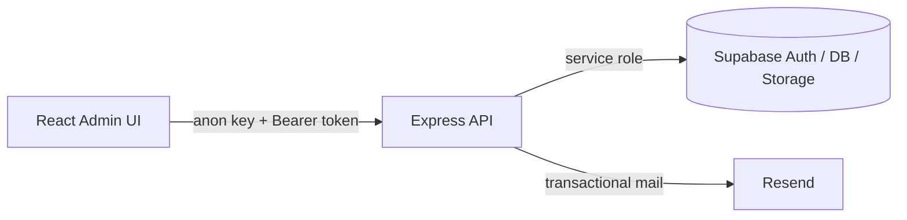

# Staff Management

Phase-1 **employee administration** module: secure admin auth, employee CRUD, and private photo storage.

Built for teams that need a clean separation between a React admin UI, an Express API, and Supabase (Auth + PostgreSQL + private Storage).

## Highlights

- Admin signup/login via Supabase Auth (service role used only on the server)
- Employee CRUD with soft-delete (`is_active`)
- Private `employee-photos` bucket — DB stores paths; API returns **signed URLs**
- Transactional admin emails via Resend
- Deploy path documented for **Railway** (API) + **Vercel** (UI)

## Architecture

```
StaffManagement/
├── client/     # React + Vite + TypeScript admin UI
├── server/     # Express API (Supabase service role, CORS allowlist)
└── supabase/   # SQL schema, triggers, storage bucket setup
```

| Layer | Responsibility |
| --- | --- |
| **Client** | Admin auth screens, employee list/forms, photo upload UX |
| **Server** | Authz with Bearer tokens, employee APIs, signed URL generation |
| **Supabase** | Auth users, `admin_profiles`, employees table, private storage |



## Stack


## Quick start

```bash
npm install --prefix server
npm install --prefix client
```

1. Run `supabase/employee_management.sql` in the Supabase SQL editor.
2. Copy `server/.env.example` → `server/.env` and `client/.env.example` → `client/.env`.
3. **Never** put the Supabase service role key in the frontend.

```bash
npm run dev:server   # http://localhost:4000
npm run dev:client   # http://localhost:5173
```

Create an admin at `/signup`, then manage employees at `/employees`.

## API (summary)

| Method | Path | Notes |
| --- | --- | --- |
| `POST` | `/api/auth/signup` | Create admin user + profile + Resend email |
| `GET` | `/api/employees` | List active employees + signed photo URLs |
| `GET` | `/api/employees/:id` | Single employee |
| `POST` | `/api/employees` | Create (+ optional multipart `photo`) |
| `PUT` | `/api/employees/:id` | Update (+ optional photo replace) |
| `DELETE` | `/api/employees/:id` | Soft delete |

Employee routes require:

```http
Authorization: Bearer <supabase_access_token>
```

## Deployment

| Surface | Host | Root |
| --- | --- | --- |
| API | Railway | `server/` |
| UI | Vercel | `client/` |

Set `FRONTEND_URLS` on the API to your Vercel origin(s). Set `VITE_API_URL` on the client to the Railway API `/api` base. Full env lists live in `.env.example` files.

## Security notes

- Service role key: **server only**
- Photos: private bucket; signed URLs at read time
- CORS: allowlist via `FRONTEND_URLS`
- Soft delete preserves auditability over hard deletes

## Status

Production-oriented Phase 1 module. Extend with roles/permissions, audit log, and org multi-tenancy as needed.
